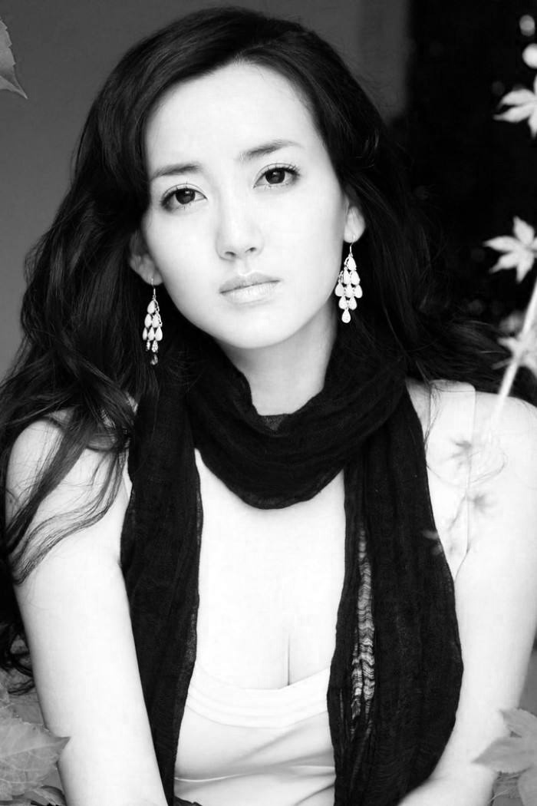
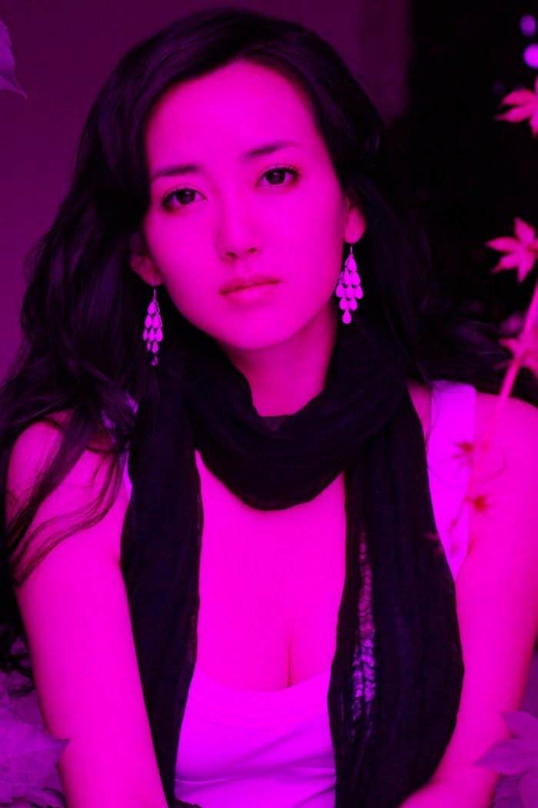
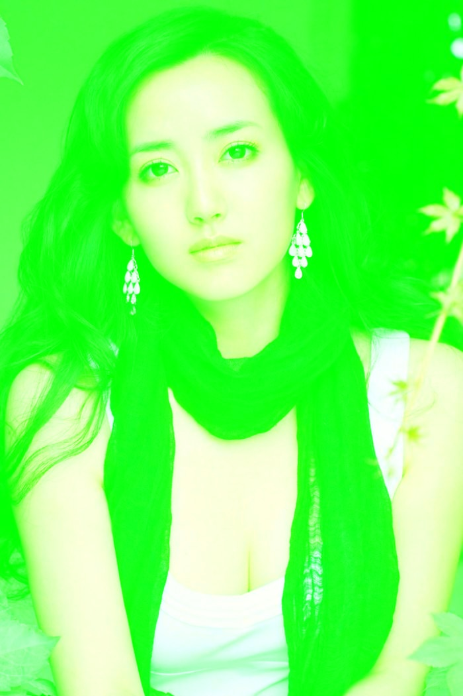
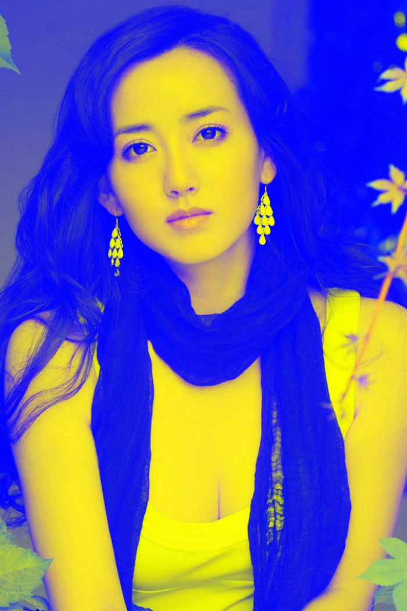

## 通道分离与合成
### 本部分实验在opencv_010子项目中

首先读取一张图片


### 通过split函数将通道分离
```
vector<Mat> src_mat;
split(src, src_mat);
imshow("blue_channels",src_mat[0]);
imshow("green_channels",src_mat[1]);
imshow("red_channels",src_mat[2]);
```

展示三个通道分离后的图片

>* b通道
 
>* g通道

>* r通道


### 改变某个通道的值然后merge合并
代码类似如下：
```
src_mat[0] = Scalar(0);
merge(src_mat,src);
imshow("b_0_merge",src);
```
>* b通道为0 
  
>* g通道为0 

>* r通道为0 


>* b通道为255
  
>* g通道为255

>* r通道为255


### 翻转某个通道，合并
```
bitwise_not(src_mat[0],src_mat[0]);
merge(src_mat,src);
imshow("bitwise_not_merge",src);

```

>*  not_blue

